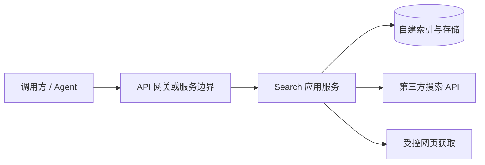

# 系统架构概要（v1）

本文档描述当前共识下的 **逻辑架构**、**技术选型** 与 **数据驻留** 边界，便于设计与评审；实现级细节见 [DETAILED_DESIGN.md](./DETAILED_DESIGN.md)。

| 文档版本 | 0.5 |
|----------|-----|

---

## 1. 目标

- 对外仅暴露 **`POST /v1/search`**，返回 **`text/markdown`**。
- **索引优先**：自建索引在「足够」时直接生成响应；不足时回落第三方搜索 API / 受控抓取，再整理为 Markdown。
- **合规**：禁止高并发爬站；**存储与索引**部署在指定 **境内** 区域；经境外搜索 API 的查询须在隐私说明中披露。

---

## 2. 技术选型

### 2.1 选型原则

| 原则 | 说明 |
|------|------|
| 与需求匹配 | 满足同步 API、索引检索、可配置阈值、可测试（接口与双倍注入） |
| 驻留与合规 | **自建索引与持久化存储**可部署在目标 **境内** 区域；跨境仅经已披露的第三方 API |
| 可运维 | 容器化、配置外置、日志结构化；与 GitHub Actions CI 兼容 |
| 可演进 | Provider、索引实现可替换；避免与单一云厂商深度耦合（除非立项另有规定） |

### 2.2 决策维度

选型时按下列维度打分（高 / 中 / 低），记录在 **技术决议**（见 §2.4）：

1. **延迟与吞吐**：P95 与单机 QPS 是否满足预期（无 SLA，但需可压测）。  
2. **生态与依赖**：HTTP 框架成熟度、向量/全文检索客户端、托管服务在境内可用性。  
3. **团队技能**：维护成本与招聘/协作匹配度。  
4. **合规与审计**：日志脱敏、密钥管理、数据区域选项。  
5. **TDD 友好**：测试隔离、接口抽象成本、CI 执行速度。

### 2.3 分层与候选技术（基线建议）

**已决议**：应用 **Go**，自建索引 **OpenSearch**（见 §2.4）。下列其他路线保留为 **后续演进** 参考；若将来引入向量库或第二语言，须更新 §2.4 与 [DETAILED_DESIGN.md](./DETAILED_DESIGN.md)。

#### 应用运行时与 API

| 方案 | 要点 | 风险/代价 |
|------|------|-----------|
| **Go** + 标准库或 Echo/Fiber/gin | 单机延迟好、二进制部署简单、并发模型清晰 | 向量生态需依赖外部服务或 CGO |
| **Python** + FastAPI/Starlette | 与 ML/文本处理生态结合快、开发效率高 | 需更注意 GIL/进程模型与依赖锁定 |
| **Node.js** + Fastify/Nest | 前后端语言统一 | CPU 密集与长连接场景需额外设计 |

**决议**：采用 **Go**（建议 **Go 1.22+**）；HTTP 路由采用 **chi v5**（候选对比见 [ROUTER_FRAMEWORK_EVALUATION.md](./ROUTER_FRAMEWORK_EVALUATION.md)）。

#### 自建索引与检索

| 方案 | 要点 | 适用 |
|------|------|------|
| **OpenSearch / Elasticsearch** | 全文 + 可选 kNN；托管在境内云常见 | 以关键词与 BM25 为主、需聚合与过滤 |
| **向量库**（如 Milvus、pgvector、云厂商向量检索） | 相似度（REQ 中「相似度分数」）表达自然 | 需 embedding 流水线与维度管理 |
| **混合** | 全文召回 + 向量重排 | 效果与复杂度最高 |

**决议**：采用 **OpenSearch 2.x**（小版本与 **境内** 托管实例对齐，在运维手册记录实际版本号）。MVP **不** 依赖独立向量索引；REQ 中的「相似度分数」由 **BM25 的 `_score` 经归一化** 代理（见 [DETAILED_DESIGN.md](./DETAILED_DESIGN.md) §6.3）。若后续引入 kNN，再评估 **OpenSearch 向量字段** 或外接向量库。

#### 持久化与元数据

| 方案 | 要点 |
|------|------|
| **PostgreSQL** | 任务/爬取状态、用户 Key 元数据（若后续需要）、与 pgvector 同栈 |
| **仅索引引擎** | MVP 若极简，可先只依赖索引存储文档；扩展期再引入 RDBMS |

**基线建议**：索引引擎存 **可检索正文与元数据**；若需 **异步写回索引** 或 **去重**，再引入 RDBMS，避免过早双写。

#### 第三方搜索 Provider

| 类型 | 说明 |
|------|------|
| 境内/合规优先 | 如 **Baidu** 等，降低出境争议；能力与配额以合同为准 |
| 境外 API | **Bing**、**Tavily** 等；须在隐私文档披露 |
| 抽象层 | 代码侧 **统一 `SearchProvider` 接口**，多实现 + 配置启用，便于 TDD 与降级 |

#### 网页获取（Fetch）

- **独立模块**：全局并发上限、单域速率、User-Agent、超时；与产品「禁止高并发爬站」一致。  
- **决议**：使用 Go **`net/http`**（或基于其的轻量封装）+ 正文抽取库（实现 PR 选定，如 `go-readability` 类库），**须在详细设计中写清单域策略**。

#### 部署与网关

| 项 | 候选 |
|----|------|
| 容器 | **Docker**；编排 **单节点 Docker Compose**（MVP）→ **K8s**（扩展期） |
| 入口 | 云 **ALB/NLB** 或 **Nginx** 反代；TLS 终止在网关 |
| 密钥 | 环境变量或 **云 KMS**；GitHub Actions 使用 **Secrets**，不写入仓库 |

#### 可观测性（建议与 REQ-NF-006 对齐）

- **日志**：结构化 JSON，`request_id` 贯穿；禁止打印完整 API Key。  
- **指标**：QPS、延迟分位、429/5xx 比率、外部 Provider 错误率。  
- **追踪**：可选 OpenTelemetry，MVP 可延后。

### 2.4 技术决议记录（须维护）

| 类别 | 决议 | 版本/规格 | 状态 | 日期 |
|------|------|-----------|------|------|
| 应用语言与运行时 | **Go** | **≥ 1.22**（以 `go.mod` 为准） | **已决议** | 2026-04-18 |
| HTTP 路由框架 | **chi v5** | `github.com/go-chi/chi/v5` | **已决议** | 2026-04-18 |
| 索引与检索引擎 | **OpenSearch** | **2.x**（与境内托管实例一致） | **已决议** | 2026-04-18 |
| 相似度（REQ） | **无独立向量时** | 使用检索 **`_score` 归一化** 作为相似度代理 | **已决议** | 2026-04-18 |
| 向量与 embedding | **MVP 不引入** | 后续若启用 kNN，再更新本表与映射 | **已决议** | 2026-04-18 |
| OpenSearch 客户端 | **官方 Go SDK** | `github.com/opensearch-project/opensearch-go`（主版本以 `go get` 为准） | **已决议** | 2026-04-18 |
| 关系型数据库 | **暂不引入** | MVP 元数据与文档以 OpenSearch 为主；异步队列后续单独立项 | **已决议** | 2026-04-18 |
| 境内区域（云/区） | 部署时填写 | 须满足存储/索引驻留 | **待基础设施** | — |
| Provider 默认组合 | 环境分档配置 | 如开发 Tavily、生产境内优先等 | **待环境** | — |

---

## 3. 逻辑组件

| 组件 | 职责 |
|------|------|
| API 边界 | 鉴权（Bearer Key）、限流、请求体校验、超时与响应 Content-Type |
| Search 应用服务 | 判定索引是否「足够」、编排回落、内容整理与 Markdown 生成、截断策略 |
| 自建索引与存储 | 持久化可检索内容与元数据；**须境内驻留** |
| 第三方搜索 API | 候选 URL/摘要等（Baidu、Bing、Tavily 等，实现期选型） |
| 受控网页获取 | 低频、合规的页面拉取；与滥用防护策略绑定 |

---

## 4. 数据流（简）

1. 请求进入 → 鉴权 → 解析 `query`。
2. 检索自建索引：若 **条数 / 长度 / 相似度** 等满足阈值 → 整理为 Markdown → **200**（可能截断，见 API 文档）。
3. 若不满足 → 调用第三方搜索 API → **（可选，服务端配置）** 对结果中的部分 **`https` 落地 URL** 做受控 GET 与正文摘录 → 整理为 Markdown → 可选写回索引（异步细节实现期定）→ **200**。
4. 触及时限或输出预算且已有部分内容 → **硬截断** → 仍 **200**。
5. 无法在时限内产生任何可用片段 → **504/503** 等（见 API 文档）。

---

## 5. 部署与驻留

- **必须**：承载 **索引与业务持久化存储** 的资源位于 **境内** 合规区域（具体云/区域在基础设施选型时写入本文档与运维手册）。
- **披露**：查询内容经 **境外** 第三方搜索服务处理的链路，在《隐私政策》/《数据处理说明》中说明。
- **不要求**：本文档不将「所有计算必须在境内」作为硬性结论；若未来合规要求提高，须单独变更评审。

---

## 6. 关联文档

- [DETAILED_DESIGN.md](./DETAILED_DESIGN.md) — 模块、接口、算法与配置级详细设计  
- [ROUTER_FRAMEWORK_EVALUATION.md](./ROUTER_FRAMEWORK_EVALUATION.md) — chi / gin / echo 评估与选型记录  
- [SEARCH_API_V1.md](./SEARCH_API_V1.md) — 对外 API 契约  

---

## 7. 文档修订

| 版本 | 日期 | 说明 |
|------|------|------|
| 0.1 | 2026-04-18 | 初稿 |
| 0.2 | 2026-04-18 | 增加技术选型原则、候选、基线建议与决议表 |
| 0.3 | 2026-04-18 | 决议 **Go + OpenSearch**；MVP 相似度由 BM25 `_score` 归一化代理 |
| 0.4 | 2026-04-18 | 决议 HTTP 路由 **chi v5**；仓库已初始化 `go.mod` |
| 0.5 | 2026-04-18 | §4 数据流：可选对 Provider 结果 URL 的受控 HTTPS 摘录（见 [AGENT_MARKDOWN_PIPELINE.md](./AGENT_MARKDOWN_PIPELINE.md)） |
